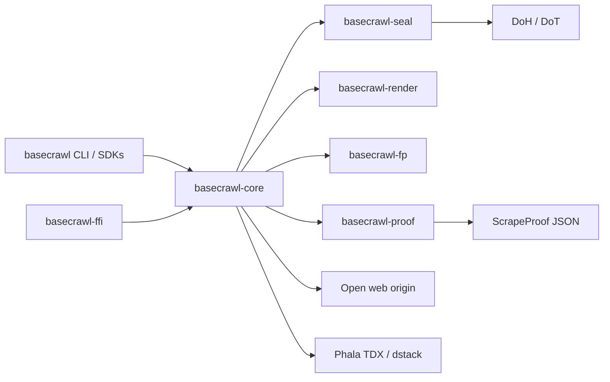

<div align="center">

# basecrawl

**Verifiable web scraping with cryptographically-anchored scrape evidence.**

<a href="docs/architecture.md">Architecture</a> ·
<a href="docs/SECURITY.md">Security</a> ·
<a href="docs/TRUST_MODEL.md">Trust model</a> ·
<a href="docs/operators/proxy-and-egress.md">Proxy & egress</a> ·
<a href="docs/operators/product-breadth-and-extract.md">Breadth & extract</a> ·
<a href="docs/tcb-inventory.md">TCB inventory</a> ·
<a href="docs/image-rotation-on-cve.md">Image rotation</a>

[](https://github.com/BaseIntelligence/basecrawl/actions/workflows/ci.yml)
[](https://github.com/BaseIntelligence/basecrawl/blob/main/LICENSE)

</div>

---

## Overview

basecrawl is an Apache-2.0 Rust workspace for platforms that need scrape evidence, not just page body text. It fetches content, captures TLS and render artifacts, and emits a canonical **ScrapeProof** JSON object. An optional Phala TDX path binds scrape hashes into a hardware quote via dstack.

The model is **cryptographically-anchored trust-but-audit**. A verifying quote on an allowlisted measurement is strong evidence that the scrape ran inside a pinned CVM image with bound hashes. It is not a claim of absolute authenticity. Residual risk (including TEE.fail on self-hosted DDR5) is documented in the security docs.

Who it serves: relay/miners and any operator that must prove what was fetched under controlled software and network assumptions. What it is not: a general-purpose anonymous proxy, a CDN, or a guarantee against every hardware or vendor residual.

## Architecture



For crate boundaries, proof fields, and validation layers, see [docs/architecture.md](docs/architecture.md).

## How it works

1. Operator or binding invokes `basecrawl` (or the FFI/Python/Node SDK) with a URL, formats, budgets, and optional task identity.
2. Fingerprint seed (if set) drives deterministic JA3/JA4, headers, UA/viewport/locale, and canvas/WebGL surface.
3. DNS (optional DoH/DoT via seal) and an HTTPS fetch capture TLS and response artifacts; optional headless Chromium handles JS render.
4. The engine assembles request, TLS, response, result, and egress fields into a single canonical `ScrapeProof`.
5. With `--attest`, the CVM asks dstack for a TDX quote whose `report_data` binds scrape hashes and the enclave signing key. Outside a CVM this fails closed (no fabricated attestation).
6. Optional seal/key-release path keeps task and result material content-confidential from the host.
7. Validators (or any verifier) check L1 measurement allowlist match and L2 `report_data` / certificate binding, then score or audit on residual confidence.

## Documentation

| Audience | Guide | Contents |
| --- | --- | --- |
| Engineers | [Architecture](docs/architecture.md) | Crates, ScrapeProof flow, mermaid |
| Operators / reviewers | [Security](docs/SECURITY.md) | Residuals, TEE.fail, operator checklist |
| Operators | [Proxy & egress](docs/operators/proxy-and-egress.md) | Universal proxy flags, composer, stealth baseline |
| Operators | [Breadth & extract](docs/operators/product-breadth-and-extract.md) | POST/crawl/map/batch + gated json extract |
| Verifiers | [Trust model](docs/TRUST_MODEL.md) | What a proof means; honesty language |
| Image maintainers | [TCB inventory](docs/tcb-inventory.md) | Measured surfaces and pins |
| Image maintainers | [Image rotation on CVE](docs/image-rotation-on-cve.md) | Digest-pinned rebuild and allowlist swap |

## Build / run / test

Toolchain is pinned in `rust-toolchain.toml` (`1.96.0`, with `rustfmt` and `clippy`). Workspace edition is `2021`. Local builds leave cargo incremental on by default; Docker image builds force `CARGO_INCREMENTAL=0` for determinism.

```bash
# full workspace check
cargo build

# release binary used by the CVM image
cargo build --release --locked --package basecrawl-core --bin basecrawl

# package-focused tests (prefer these on small machines)
cargo test --package basecrawl-core
cargo test --package basecrawl-proof
cargo test --package basecrawl-seal
cargo test --package basecrawl-fp
cargo test --package basecrawl-render
cargo test --package basecrawl-ffi

# full CI-style suite (needs optional hermetic httpbin for HTTP semantics)
cargo test --workspace --all-features
```

### CLI

`basecrawl` scrapes a single URL and writes **exactly one** canonical `ScrapeProof` JSON object to stdout. On failure it writes `{"error": ...}` to stderr and exits non-zero (no partial proof on stdout).

```bash
# basic scrape (default formats: markdown,metadata)
basecrawl https://example.com/

# formats, budgets, task identity
basecrawl \
  --formats markdown,metadata,rawHtml \
  --task-id JOB-1 \
  --nonce once-abc \
  --timeout 60 \
  --max-body-bytes 10485760 \
  https://example.com/

# headless render
basecrawl --wait-for "#ready" --render-timeout 30 --viewport 1280x800 \
  --screenshot-full-page --screenshot-out /tmp/page.png \
  https://example.com/

# product breadth: POST (soft path), crawl MVP, map-lite, batch
basecrawl --method POST --body '{"q":1}' --header 'Content-Type: application/json' \
  --no-js https://example.com/api
basecrawl --mode crawl --max-crawl-pages 5 --max-depth 1 https://example.com/
basecrawl --mode map --max-urls 50 https://example.com/
basecrawl --mode batch --urls https://example.com/,https://example.org/ --concurrency 2

# universal proxy (set BASECRAWL_HTTPS_PROXY in the environment; never commit credentials)
basecrawl --proxy-class residential --proxy-session s1 --proxy-country US \
  --formats markdown,metadata https://example.com/

# structured json extract is gated (unsupported without extractor / key; never forged success)
basecrawl --formats json --schema '{"type":"object"}' --prompt 'title' https://example.com/

# TEE path: TDX quote + enclave signature via /var/run/dstack.sock
basecrawl --attest --task-id JOB-1 --nonce once-abc \
  --formats markdown,metadata,rawHtml --timeout 60 --no-js \
  https://example.com/
```

Useful flags: `--header`, `--cookie`, `--auth-header`, `--basic-auth`, `--no-js`, `--actions`, `--follow-pagination` / `--max-pages`, `--robots`, `--fingerprint-seed`, `--sign-proof`, `--insecure` (diagnostic only), `--verbose`.

Proxy / hard path: `--proxy`, `--proxy-session`, `--proxy-country`, `--proxy-username-template`, `--proxy-class`, `--difficulty`, `--force-browser`, `--keep-browser-profile`. See [proxy and egress](docs/operators/proxy-and-egress.md). Credentials stay in env/file only.

Extract honesty: `--formats json` with `--json-schema` / `--json-prompt` fails closed without a live extractor (`structured_extraction_unsupported` or `invalid_json_schema`). Optional env keys: `BASECRAWL_EXTRACT_API_KEY` / `OPENAI_API_KEY`. Never fabricates empty success JSON. See [breadth and extract](docs/operators/product-breadth-and-extract.md).

Proof surface (schema version 1) includes `request`, `tls`, `response`, `result`, `egress`, `attestation`, and `sdk_signature`. With `--attest` / `--sign-proof` the proof binds request/cert/transcript/response/result hashes and the Ed25519 public key into TDX `report_data`, then signs the envelope with the enclave key.

Supporting capabilities: seeded fingerprints, universal proxy + Chromium composer, stealth hard-path baseline, soft TLS chrome-impersonate for soft targets only, in-enclave DoH privacy for DNS, landmark RTT echo, sealed task decrypt / result seal, digest-pinned CVM images, and optional CapSolver (`CAPSOLVER_API_KEY` + `--captcha-solver capsolver`; soft CI never requires a key). Residual risk (proxy is not anonymity, headless/CDP residual, challenge detect-not-solve default / optional CapSolver not commercial Web Unlocker parity, soft TLS ≠ Chromium wire, TEE.fail) is in [SECURITY.md](docs/SECURITY.md) and [proxy & egress](docs/operators/proxy-and-egress.md).

## CVM image

Product image (digest-pinned; do not float on `:latest`):

```text
docker.io/mathiiss/basecrawl-cvm@sha256:ba24465efe709c3f071696d807076eb5517d671c1e6f17ca0fe7143178d51e1a
```

| Property | Value |
| --- | --- |
| Placement | TDX CVM on Phala (`kms_type: phala`) |
| Guest OS | dstack `0.5.9` family / slug `dstack-0.5.9-bd369a8c` |
| Socket | `/var/run/dstack.sock` (`Info`, `GetQuote`, related endpoints) |
| Compose / measurements | Under [`image/`](image/) |

Validators authenticate a run by L1 measurement allowlist match plus L2 `report_data` binding, not by shipping the binary alone.

## Environment and dependencies

- Rust **1.96.0** (`rust-toolchain.toml`)
- Linux/amd64 for the CVM image
- Chromium for render: supplied inside the CVM Dockerfile; host CLI needs a compatible browser when JS render is enabled
- TLS: `rustls` + WebPKI roots; HTTPS for authenticity-capable proofs
- Docker BuildKit for image builds after `image/Dockerfile`
- Optional: Phala / dstack socket for live TDX quotes
- Bindings: Python (PyO3) and Node (N-API) under `bindings/`

## Repository layout

```text
basecrawl/
├── crates/
│   ├── basecrawl-core/     # crawler engine + CLI
│   ├── basecrawl-proof/    # ScrapeProof wire types
│   ├── basecrawl-render/   # headless Chromium
│   ├── basecrawl-seal/     # key-release, DoH, seal/redact
│   ├── basecrawl-fp/       # seeded fingerprints
│   └── basecrawl-ffi/      # C ABI
├── bindings/{python,node,c}/
├── image/                  # Dockerfile, compose, allowlist tools
├── docs/                   # product security + architecture
├── vendor/headless_chrome/ # patched dep (workspace exclude)
└── Cargo.toml
```

| Path | Role |
| --- | --- |
| `crates/basecrawl-core` | Engine, CLI, fetch, formats, RTT, proof assembly |
| `crates/basecrawl-proof` | Canonical wire types and serialization |
| `crates/basecrawl-render` | Headless Chromium (patched `headless_chrome`) |
| `crates/basecrawl-seal` | RA-TLS key-release, DoH/DoT, sealed tasks, host-safe redaction |
| `crates/basecrawl-fp` | JA3/JA4, headers, UA/viewport/locale, canvas/WebGL |
| `crates/basecrawl-ffi` | Stable C ABI for language bindings |
| `bindings/{python,node}` | Thin SDK wrappers |
| `image/` | Digest-pinned CVM Dockerfile, compose, measurement tooling |

`vendor/headless_chrome` is excluded from the workspace and patched via `[patch.crates-io]`.

## License

Apache License 2.0. See [`LICENSE`](LICENSE).
