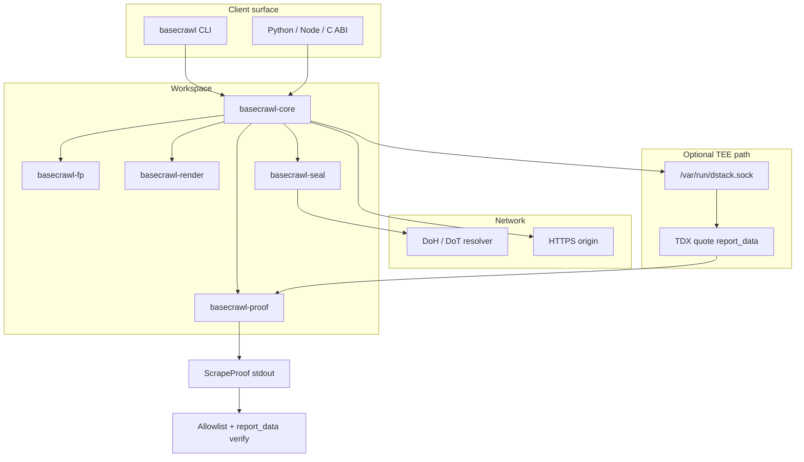
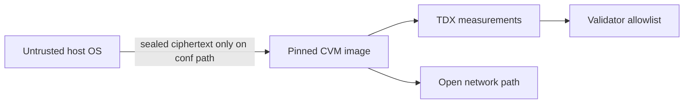

# Architecture

basecrawl is a Rust workspace that turns a fetch into a single, verifiable **ScrapeProof** envelope. Optional Phala TDX attestation binds scrape hashes into a hardware quote. This page covers crate layout, the proof assembly path, and trust boundaries.

Companion docs: [Security](SECURITY.md), [Trust model](TRUST_MODEL.md), [TCB inventory](tcb-inventory.md), [Image rotation](image-rotation-on-cve.md).

## System flow

## Crates

| Crate | Responsibility |
| --- | --- |
| `basecrawl-core` | Crawl orchestration, CLI binary `basecrawl`, formats, landmark RTT echo, proof assembly |
| `basecrawl-proof` | Canonical schema, types, and serialization for `ScrapeProof` |
| `basecrawl-render` | Headless Chromium path via patched `headless_chrome` |
| `basecrawl-fp` | Seeded JA3/JA4, HTTP headers, UA/viewport/locale, canvas/WebGL |
| `basecrawl-seal` | RA-TLS / key-release, DoH/DoT, sealed task decrypt, result seal, redaction |
| `basecrawl-ffi` | Stable C ABI consumed by Python and Node bindings |

Workspace members and shared dependency pins live in the root `Cargo.toml` (`edition = "2021"`, `rust-version = "1.96"`). `vendor/headless_chrome` is excluded from the workspace and selected through `[patch.crates-io]`.

## ScrapeProof surface

One successful scrape produces exactly one JSON object on stdout (schema version 1). Typical top-level fields:

| Field | Role |
| --- | --- |
| `request` | URL, method, headers surface, task identity |
| `tls` | Certificate and handshake evidence where available |
| `response` | Status, headers, body digests and size budgets |
| `result` | Requested formats (markdown, metadata, raw HTML, etc.) |
| `egress` | Egress and landmark/RTT observations when enabled |
| `attestation` | Optional TDX quote, measurement-related material, signatures |
| `sdk_signature` | Optional envelope signature over the proof |

With `--attest` / `--sign-proof`, request/cert/transcript/response/result hashes and the Ed25519 public key are bound into TDX `report_data`. The enclave then signs the envelope. Outside a live CVM socket, attestation fails closed and fields are not invented.

## Proof assembly path

1. **Identity and seed**: optional `--task-id`, `--nonce`, `--fingerprint-seed`.
2. **Resolve and fetch**: seal DNS privacy when configured; HTTPS fetch with rustls / WebPKI roots.
3. **Optional render**: Chromium only when JS or screenshots are required.
4. **Canonicalize**: core packs artifacts into `basecrawl-proof` types.
5. **Attest (optional)**: dstack quote for pinned CVM image; report_data hash binding.
6. **Emit**: one JSON object. Errors leave stdout empty of partial proofs and print structured stderr.

## Trust boundaries

| Boundary | Trust stance |
| --- | --- |
| Host OS | Untrusted. Content-confidential path aims to keep path/query/headers/body/result out of host plaintext. |
| Pinned CVM image | Measurement identity for L1. Digest pins live under `image/`. |
| Network path | Intermediate witnesses and origins remain residual; L2 certificate and audit apply. |
| Validator | L1 measurement allowlist + L2 report_data binding; scoring and audit live on the consumer (e.g. relay). |

Authenticity is **cryptographically-anchored trust-but-audit**. Measurement match shows software identity, not freedom from unknown Chromium/OS bugs or physical host attacks. See [SECURITY.md](SECURITY.md) for TEE.fail residual and managed-cloud mitigation.

## CVM deployment sketch

- Image: `docker.io/mathiiss/basecrawl-cvm` at a fixed digest (never float `:latest` for verification).
- Guest: dstack `0.5.9` family; app talks to `/var/run/dstack.sock`.
- Operator pins the six-field measurement tuple in the platform allowlist; rotated via the [image rotation runbook](image-rotation-on-cve.md).
- Compose and offline measurement tools: `image/Dockerfile`, `image/docker-compose.yml`, `image/allowlist.json`, `image/reproducibility.py`.

## Bindings

`basecrawl-ffi` exposes the C ABI. Thin wrappers:

- `bindings/python` - PyO3 extension module
- `bindings/node` - N-API package
- `bindings/c` - headers / examples for direct C consumers

Bindings must not weaken attestation fail-closed rules or invent proof fields.
